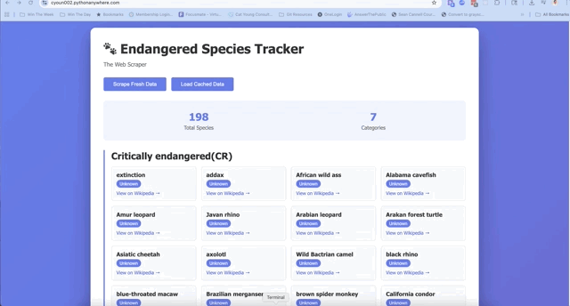

# 🐾 Endangered Species Tracker

A full-stack web application that scrapes endangered species data from the web and displays it in an accessible, responsive interface.

**Built as a portfolio project for Skillcrush Full-Stack Development Program**

## 🌐 Live Demo

**[View Live Site](https://cyoun002.pythonanywhere.com)** ⬅️ Click to see it in action!

*Note: Backend may take a moment on first load as data is scraped from Wikipedia.*

---

## 📋 Project Overview

This project demonstrates full-stack development skills by combining Python web scraping with a modern frontend interface. The application scrapes endangered species data, classifies each animal by retrieving information from Wikipedia, and presents the data in an intuitive, accessible web interface.

**Built as a portfolio project for Skillcrush Full Stack Development Program**

## 🎬 Demo



*The application automatically loads endangered species data and displays it in an intuitive, accessible interface with search functionality and detailed animal classifications.*

---

## ✨ Features

- **Web Scraping**: Automatically scrapes endangered species data from source websites
- **API Integration**: Fetches animal classification data from Wikipedia
- **RESTful API**: Flask backend with JSON endpoints
- **Responsive Design**: Mobile-friendly interface that works on all devices
- **Accessibility First**: WCAG compliant with keyboard navigation and screen reader support
- **Data Caching**: Stores scraped data locally for faster subsequent loads
- **Real-time Updates**: Live scraping with loading indicators

## 🛠️ Tech Stack

### Backend
- **Python 3.x**
- **Flask** - Web framework
- **BeautifulSoup4** - Web scraping
- **Requests** - HTTP library
- **Flask-CORS** - Cross-origin resource sharing

### Frontend
- **HTML5** - Semantic markup
- **CSS3** - Modern styling with Grid and Flexbox
- **JavaScript (ES6+)** - Async/await, Fetch API
- **Accessible Design** - ARIA labels, keyboard navigation

## 📦 Installation

### Prerequisites
- Python 3.7 or higher
- pip (Python package manager)

### Setup Steps

1. **Clone the repository**
```bash
   git clone https://github.com/yourusername/endangered-species-tracker.git
   cd endangered-species-tracker
```

2. **Create a virtual environment**
```bash
   python3 -m venv venv
   source venv/bin/activate  # On Windows: venv\Scripts\activate
```

3. **Install dependencies**
```bash
   pip install flask flask-cors requests beautifulsoup4
```

4. **Run the Flask server**
```bash
   python main.py
```
   The server will start on `http://127.0.0.1:5000`

5. **Open the frontend**
   - Simply open `index.html` in your web browser
   - Or use a local server for best results

## 🚀 Usage

### API Endpoints

#### `GET /api/scrape`
Scrapes fresh data from the source and returns all endangered species with their classifications.

**Response:**
```json
{
  "Category Name": [
    {
      "name": "Animal Name",
      "url": "https://wikipedia.org/...",
      "class": "Mammalia"
    }
  ]
}
```

#### `GET /api/data`
Returns cached data from the last scrape.

**Response:** Same format as `/api/scrape`

### Frontend Usage

1. **Scrape Fresh Data**: Click the "Scrape Fresh Data" button to fetch new data (takes 30-60 seconds)
2. **Load Cached Data**: Click "Load Cached Data" to instantly display previously scraped data
3. **View Details**: Click on any animal card's Wikipedia link to learn more
4. **Keyboard Navigation**: Use Tab key to navigate, Enter/Space to activate buttons

## ♿ Accessibility Features

- **Semantic HTML**: Proper use of `<main>`, `<header>`, `<nav>`, `<section>`, and `<article>` tags
- **ARIA Labels**: Descriptive labels for screen readers
- **Keyboard Navigation**: Full functionality without a mouse
- **Focus Indicators**: Clear visual feedback for keyboard users
- **Screen Reader Support**: Live regions announce dynamic content changes
- **Color Contrast**: WCAG AA compliant contrast ratios
- **Reduced Motion**: Respects user's motion preferences
- **High Contrast Mode**: Enhanced visibility in accessibility modes

## 📁 Project Structure
```
endangered-species-tracker/
├── venv/                          # Virtual environment
├── index.html                     # Main HTML file
├── styles.css                     # Styling
├── script.js                      # Frontend JavaScript
├── main.py                        # Flask backend
├── endangered_species.json        # Cached data
├── README.md                      # Project documentation
└── .gitignore                     # Git ignore file
```

## 🔧 How It Works

1. **Backend Scraping**: 
   - `get_categories()` scrapes the main endangered species page
   - Extracts animal names and Wikipedia URLs
   - `get_animal_class()` visits each Wikipedia page to find the animal's class

2. **API Layer**:
   - Flask serves two endpoints: `/api/scrape` and `/api/data`
   - CORS enabled for cross-origin requests
   - Data cached as JSON for performance

3. **Frontend Display**:
   - Fetches data from Flask API
   - Dynamically generates HTML cards for each animal
   - Displays statistics (total species, categories)
   - Handles loading states and errors gracefully

## 🎨 Design Decisions

- **Single-Page Application**: Simple, fast user experience
- **Gradient Background**: Modern, visually appealing design
- **Card Layout**: Easy to scan, mobile-friendly
- **Purple Color Scheme**: Professional and memorable
- **Grid System**: Responsive layout that adapts to screen size

## 🐛 Known Issues & Future Improvements

- [ ] Add search/filter functionality
- [ ] Implement database instead of JSON file
- [ ] Add user authentication
- [ ] Deploy to cloud platform (Heroku/AWS)
- [ ] Add data visualization (charts/graphs)
- [ ] Implement rate limiting for API calls

## 📝 Learning Outcomes

Through this project, I learned:
- Web scraping techniques with BeautifulSoup
- RESTful API design with Flask
- Asynchronous JavaScript with Fetch API
- Responsive web design principles
- Accessibility best practices (ARIA, semantic HTML)
- Git version control
- Virtual environment management

## 🙏 Acknowledgments

- [Skillcrush](https://skillcrush.com/) - For the bootcamp curriculum
- Endangered species data source: [Skillcrush GitHub](https://skillcrush.github.io/web-scraping-endangered-species/)
- Animal classification data: [Wikipedia](https://wikipedia.org)

## 📧 Contact

**[Cat Young]**
- Portfolio: [catyoung018.github.io/Cat-Young-Dev](https://catyoung018.github.io/Cat-Young-Dev/)
- LinkedIn: [linkedin.com/in/catrilliayoung](https://linkedin.com/in/catrilliayoung)
- GitHub: [github.com/CatYoung018](https://github.com/CatYoung018)

## 📄 License

This project is open source and available under the [MIT License](LICENSE).

---

**Created as a portfolio project for [Skillcrush] - December 2025**

---


